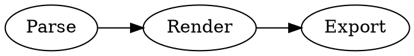

# Kroki対応形式（非UML）テスト

## graphviz



## d2

```d2
a -> b: hello
b -> c: world
```

## erd

```erd
[users]
*id
name

[orders]
*id
user_id

users 1--* orders
```

## svgbob

```svgbob
+--------+
| Start  |
+---+----+
    |
    v
+---+----+
|  End   |
+--------+
```

## vega

```vega
{
  "$schema": "https://vega.github.io/schema/vega/v5.json",
  "width": 200,
  "height": 120,
  "padding": 5,
  "data": [{
    "name": "table",
    "values": [
      {"x": 1, "y": 28},
      {"x": 2, "y": 55},
      {"x": 3, "y": 43}
    ]
  }],
  "scales": [
    {"name": "x", "type": "linear", "domain": {"data": "table", "field": "x"}, "range": "width"},
    {"name": "y", "type": "linear", "domain": {"data": "table", "field": "y"}, "range": "height"}
  ],
  "axes": [
    {"orient": "bottom", "scale": "x"},
    {"orient": "left", "scale": "y"}
  ],
  "marks": [{
    "type": "line",
    "from": {"data": "table"},
    "encode": {
      "enter": {
        "x": {"scale": "x", "field": "x"},
        "y": {"scale": "y", "field": "y"},
        "stroke": {"value": "#1f77b4"}
      }
    }
  }]
}
```

## actdiag

```actdiag
actdiag {
  A -> B -> C;
}
```

## blockdiag

```blockdiag
blockdiag {
  A -> B -> C;
}
```

## bpmn

```bpmn
<?xml version="1.0" encoding="UTF-8"?>
<bpmn:definitions xmlns:xsi="http://www.w3.org/2001/XMLSchema-instance" xmlns:bpmn="http://www.omg.org/spec/BPMN/20100524/MODEL" xmlns:bpmndi="http://www.omg.org/spec/BPMN/20100524/DI" xmlns:dc="http://www.omg.org/spec/DD/20100524/DC" xmlns:di="http://www.omg.org/spec/DD/20100524/DI" id="Definitions_1" targetNamespace="http://bpmn.io/schema/bpmn">
  <bpmn:process id="Process_1" isExecutable="false">
    <bpmn:startEvent id="StartEvent_1"/>
  </bpmn:process>
  <bpmndi:BPMNDiagram id="BPMNDiagram_1">
    <bpmndi:BPMNPlane id="BPMNPlane_1" bpmnElement="Process_1">
      <bpmndi:BPMNShape id="StartEvent_1_di" bpmnElement="StartEvent_1">
        <dc:Bounds x="173" y="102" width="36" height="36"/>
      </bpmndi:BPMNShape>
    </bpmndi:BPMNPlane>
  </bpmndi:BPMNDiagram>
</bpmn:definitions>
```

## bytefield

```bytefield
(defattrs :bg-green {:fill "#a0ffa0"})
(defattrs :bg-yellow {:fill "#ffffa0"})
(defattrs :bg-pink {:fill "#ffb0a0"})
(defattrs :bg-cyan {:fill "#a0fafa"})
(defattrs :bg-purple {:fill "#e4b5f7"})

(defn draw-group-label-header
  [span label]
  (draw-box (text label [:math {:font-size 12}]) {:span span :borders #{} :height 14}))

(defn draw-remotedb-header
  [kind args]
  (draw-column-headers)
  (draw-group-label-header 5 "start")
  (draw-group-label-header 5 "TxID")
  (draw-group-label-header 3 "type")
  (draw-group-label-header 2 "args")
  (draw-group-label-header 1 "tags")
  (next-row 18)

  (draw-box 0x11 :bg-green)
  (draw-box 0x872349ae [{:span 4} :bg-green])
  (draw-box 0x11 :bg-yellow)
  (draw-box (text "TxID" :math) [{:span 4} :bg-yellow])
  (draw-box 0x10 :bg-pink)
  (draw-box (hex-text kind 4 :bold) [{:span 2} :bg-pink])
  (draw-box 0x0f :bg-cyan)
  (draw-box (hex-text args 2 :bold) :bg-cyan)
  (draw-box 0x14 :bg-purple)

  (draw-box (text "0000000c" :hex [[:plain {:font-weight "light" :font-size 16}] " (12)"]) [{:span 4} :bg-purple])
  (draw-box (hex-text 6 2 :bold) [:box-first :bg-purple])
  (doseq [val [6 6 3 6 6 6 6 3]]
    (draw-box (hex-text val 2 :bold) [:box-related :bg-purple]))
  (doseq [val [0 0]]
    (draw-box val [:box-related :bg-purple]))
  (draw-box 0 [:box-last :bg-purple]))

(draw-remotedb-header 0x4702 9)

(draw-box 0x11)
(draw-box 0x2104 {:span 4})
(draw-box 0x11)
(draw-box 0 {:span 4})
(draw-box 0x11)
(draw-box (text "length" [:math] [:sub 1]) {:span 4})
(draw-box 0x14)

(draw-box (text "length" [:math] [:sub 1]) {:span 4})
(draw-gap "Cue and loop point bytes")

(draw-box nil :box-below)
(draw-box 0x11)
(draw-box 0x36 {:span 4})
(draw-box 0x11)
(draw-box (text "num" [:math] [:sub "hot"]) {:span 4})
(draw-box 0x11)
(draw-box (text "num" [:math] [:sub "cue"]) {:span 4})

(draw-box 0x11)
(draw-box (text "length" [:math] [:sub 2]) {:span 4})
(draw-box 0x14)
(draw-box (text "length" [:math] [:sub 2]) {:span 4})
(draw-gap "Unknown bytes" {:min-label-columns 6})
(draw-bottom)
```

## c4plantuml

```c4plantuml
@startuml
!include https://raw.githubusercontent.com/plantuml-stdlib/C4-PlantUML/master/C4_Context.puml
Person(user, "User")
System(app, "App")
Rel(user, app, "uses")
@enduml
```

## dbml

```dbml
Table users {
  id int [pk]
  name varchar
}
```

## ditaa

```ditaa
+--------+    +--------+
|  Start | -> |  End   |
+--------+    +--------+
```

## excalidraw

stop

## nomnoml

```nomnoml
[Client]->[Server]
```

## nwdiag

```nwdiag
nwdiag {
  network dmz {
    web;
  }
}
```

## packetdiag

```packetdiag
packetdiag {
  0-7: Version;
}
```

## pikchr

```pikchr
box "A"
arrow right
box "B"
```

## rackdiag

```rackdiag
rackdiag {
  16U;
  1: Server [3U];
  5: Switch [1U];
}
```

## seqdiag

```seqdiag
seqdiag {
  A -> B [label = "hello"];
}
```

## structurizr

```structurizr
workspace {
  model {
    user = person "User"
    s = softwareSystem "System"
    user -> s "Uses"
  }
  views {
    systemContext s {
      include *
      autoLayout
    }
    theme default
  }
}
```

## umlet

```umlet
<?xml version="1.0" encoding="UTF-8"?>
<diagram program="umlet" version="15.1">
  <zoom_level>10</zoom_level>
  <element>
    <id>UMLClass</id>
    <coordinates><x>20</x><y>20</y><w>140</w><h>90</h></coordinates>
    <panel_attributes>TestClass
--
+ id: int
+ name: string</panel_attributes>
    <additional_attributes/>
  </element>
</diagram>
```

## vegalite

```vegalite
{
  "$schema": "https://vega.github.io/schema/vega-lite/v5.json",
  "description": "A simple bar chart",
  "data": {"values": [{"a": "A", "b": 28}, {"a": "B", "b": 55}]},
  "mark": "bar",
  "encoding": {
    "x": {"field": "a", "type": "nominal"},
    "y": {"field": "b", "type": "quantitative"}
  }
}
```

## wavedrom

```wavedrom
{ "signal": [
  { "name": "clk", "wave": "p...." },
  { "name": "data", "wave": "x.345" }
]}
```

## wireviz

```wireviz
connectors:
  X1:
    pinlabels: ["1", "2"]
cables:
  W1:
    wirecount: 2
connections:
  - - X1: ["1", "2"]
    - W1: [1,2]
```