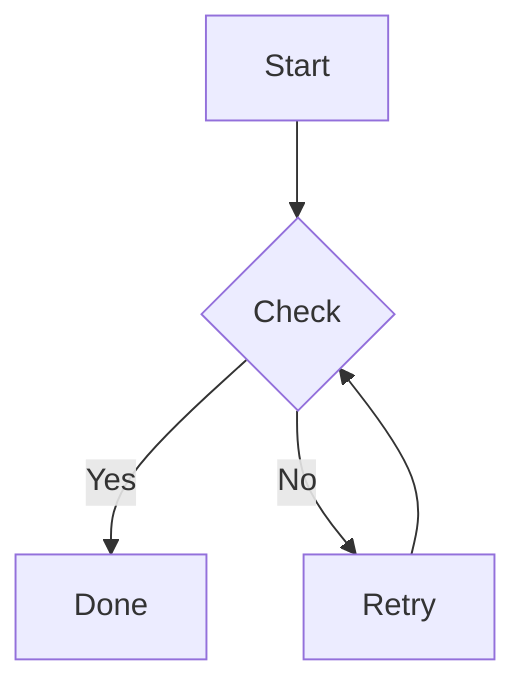
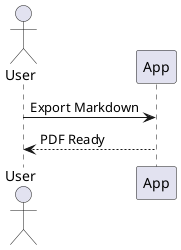
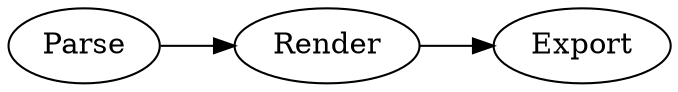

# All-in-One Markdown + Diagram Test

このファイルは、Markdown の主要構文と、拡張が対応する図コードブロックをまとめて検証するためのサンプルです。

---

## 1. 見出し

### H3

#### H4

## 2. テキスト装飾

- **太字**
- *斜体*
- ~~打ち消し~~
- `inline code`
- [リンク](https://example.com)

## 3. 引用

> これは引用です。
>
> - 引用内リスト
> - 2つ目

## 4. リスト

1. 番号付き 1
2. 番号付き 2
   - ネスト箇条書き A
   - ネスト箇条書き B

- [x] タスク完了
- [ ] タスク未完了

## 5. 表

| 項目  |   値 | 備考   |
| ----- | ---: | ------ |
| alpha |   10 | 左揃え |
| beta  |   20 | 右揃え |

## 6. コードブロック（通常）

```ts
function greet(name: string): string {
  return `Hello, ${name}`;
}
```

## 7. Mermaid（ローカル描画）



## 8. UML / PlantUML（Kroki）

```uml
@startuml
Alice -> Bob: Hello
Bob --> Alice: Hi
@enduml
```



## 9. Kroki対応形式（非UML）

### graphviz



### d2

```d2
a -> b: hello
b -> c: world
```

### erd

```erd
[users]
*id
name

[orders]
*id
user_id

users 1--* orders
```

### svgbob

```svgbob
+--------+
| Start  |
+---+----+
    |
    v
+---+----+
|  End   |
+--------+
```

### vega

```vega
{
  "$schema": "https://vega.github.io/schema/vega/v5.json",
  "width": 200,
  "height": 120,
  "padding": 5,
  "data": [{
    "name": "table",
    "values": [
      {"x": 1, "y": 28},
      {"x": 2, "y": 55},
      {"x": 3, "y": 43}
    ]
  }],
  "scales": [
    {"name": "x", "type": "linear", "domain": {"data": "table", "field": "x"}, "range": "width"},
    {"name": "y", "type": "linear", "domain": {"data": "table", "field": "y"}, "range": "height"}
  ],
  "axes": [
    {"orient": "bottom", "scale": "x"},
    {"orient": "left", "scale": "y"}
  ],
  "marks": [{
    "type": "line",
    "from": {"data": "table"},
    "encode": {
      "enter": {
        "x": {"scale": "x", "field": "x"},
        "y": {"scale": "y", "field": "y"},
        "stroke": {"value": "#1f77b4"}
      }
    }
  }]
}
```

## 10. Kroki対応形式（全対応フェンス実例）

### actdiag

```actdiag
actdiag {
  A -> B -> C;
}
```

### blockdiag

```blockdiag
blockdiag {
  A -> B -> C;
}
```

### bpmn

```bpmn
<?xml version="1.0" encoding="UTF-8"?>
<bpmn:definitions xmlns:xsi="http://www.w3.org/2001/XMLSchema-instance" xmlns:bpmn="http://www.omg.org/spec/BPMN/20100524/MODEL" xmlns:bpmndi="http://www.omg.org/spec/BPMN/20100524/DI" xmlns:dc="http://www.omg.org/spec/DD/20100524/DC" xmlns:di="http://www.omg.org/spec/DD/20100524/DI" id="Definitions_1" targetNamespace="http://bpmn.io/schema/bpmn">
  <bpmn:process id="Process_1" isExecutable="false">
    <bpmn:startEvent id="StartEvent_1"/>
  </bpmn:process>
  <bpmndi:BPMNDiagram id="BPMNDiagram_1">
    <bpmndi:BPMNPlane id="BPMNPlane_1" bpmnElement="Process_1">
      <bpmndi:BPMNShape id="StartEvent_1_di" bpmnElement="StartEvent_1">
        <dc:Bounds x="173" y="102" width="36" height="36"/>
      </bpmndi:BPMNShape>
    </bpmndi:BPMNPlane>
  </bpmndi:BPMNDiagram>
</bpmn:definitions>
```

### bytefield

```bytefield
draw_column_labels {bit 7, bit 0}
box {8} "byte"
```

### c4plantuml

```c4plantuml
@startuml
!include https://raw.githubusercontent.com/plantuml-stdlib/C4-PlantUML/master/C4_Context.puml
Person(user, "User")
System(app, "App")
Rel(user, app, "uses")
@enduml
```

### dbml

```dbml
Table users {
  id int [pk]
  name varchar
}
```

### ditaa

```ditaa
+--------+    +--------+
|  Start | -> |  End   |
+--------+    +--------+
```

### excalidraw

```excalidraw
{
  "type": "excalidraw",
  "version": 2,
  "source": "https://excalidraw.com",
  "elements": [],
  "appState": {
    "gridSize": null
  },
  "files": {}
}
```

### nomnoml

```nomnoml
[Client]->[Server]
```

### nwdiag

```nwdiag
nwdiag {
  network dmz {
    web;
  }
}
```

### packetdiag

```packetdiag
packetdiag {
  0-7: Version;
}
```

### pikchr

```pikchr
box "A"
arrow right
box "B"
```

### rackdiag

```rackdiag
rackdiag {
  16U;
  1: Server [3U];
  5: Switch [1U];
}
```

### seqdiag

```seqdiag
seqdiag {
  A -> B [label = "hello"];
}
```

### structurizr

```structurizr
workspace {
  model {
    user = person "User"
    s = softwareSystem "System"
    user -> s "Uses"
  }
  views {
    systemContext s {
      include *
      autoLayout
    }
    theme default
  }
}
```

### umlet

```umlet
<?xml version="1.0" encoding="UTF-8"?>
<diagram program="umlet" version="15.1">
  <zoom_level>10</zoom_level>
  <element>
    <id>UMLClass</id>
    <coordinates><x>20</x><y>20</y><w>140</w><h>90</h></coordinates>
    <panel_attributes>TestClass
--
+ id: int
+ name: string</panel_attributes>
    <additional_attributes/>
  </element>
</diagram>
```

### vegalite

```vegalite
{
  "$schema": "https://vega.github.io/schema/vega-lite/v5.json",
  "description": "A simple bar chart",
  "data": {"values": [{"a": "A", "b": 28}, {"a": "B", "b": 55}]},
  "mark": "bar",
  "encoding": {
    "x": {"field": "a", "type": "nominal"},
    "y": {"field": "b", "type": "quantitative"}
  }
}
```

### wavedrom

```wavedrom
{ "signal": [
  { "name": "clk", "wave": "p...." },
  { "name": "data", "wave": "x.345" }
]}
```

### wireviz

```wireviz
connectors:
  X1:
    pinlabels: ["1", "2"]
cables:
  W1:
    wirecount: 2
connections:
  - - X1: ["1", "2"]
    - W1: [1,2]
```

### tex

```tex
\frac{a^2 + b^2}{c^2} = 1
```

---

## 11. 画像


## 12. 区切り線

---

## 13. 最終確認メモ

- Mermaid はローカル描画
- UML/PlantUML と Kroki対応形式は Kroki 経由
- 変換失敗時はコードブロック表示にフォールバック
