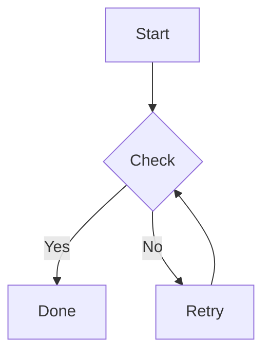
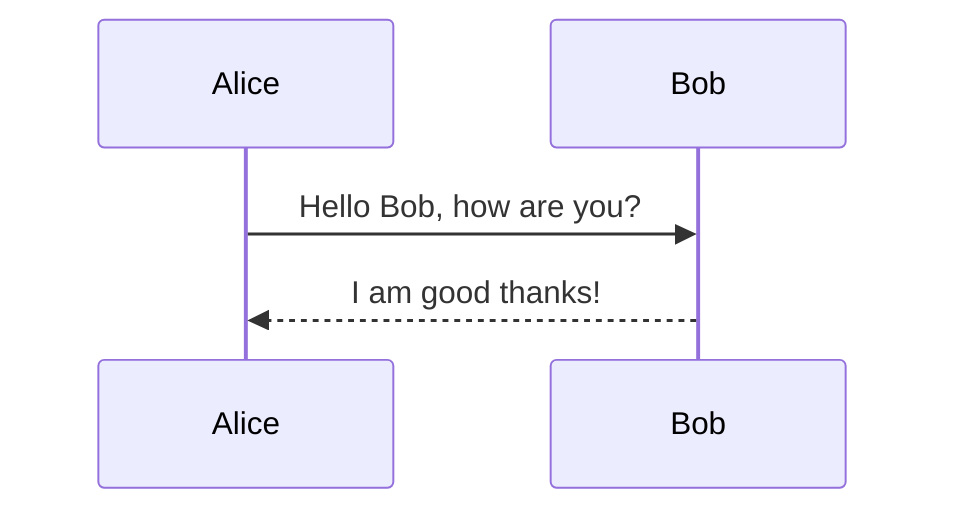
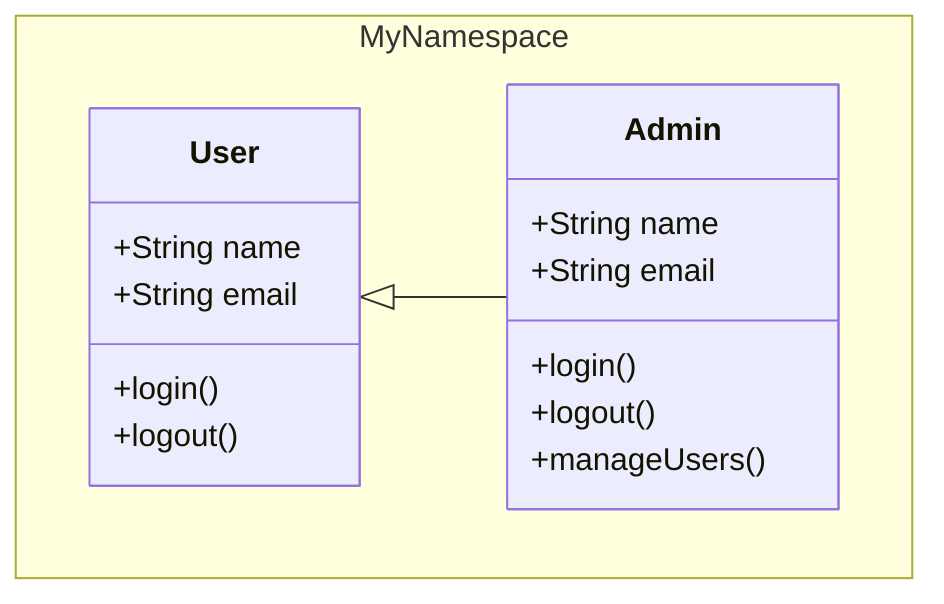
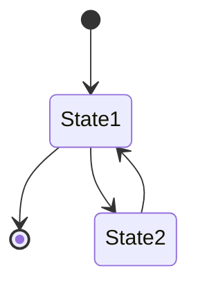
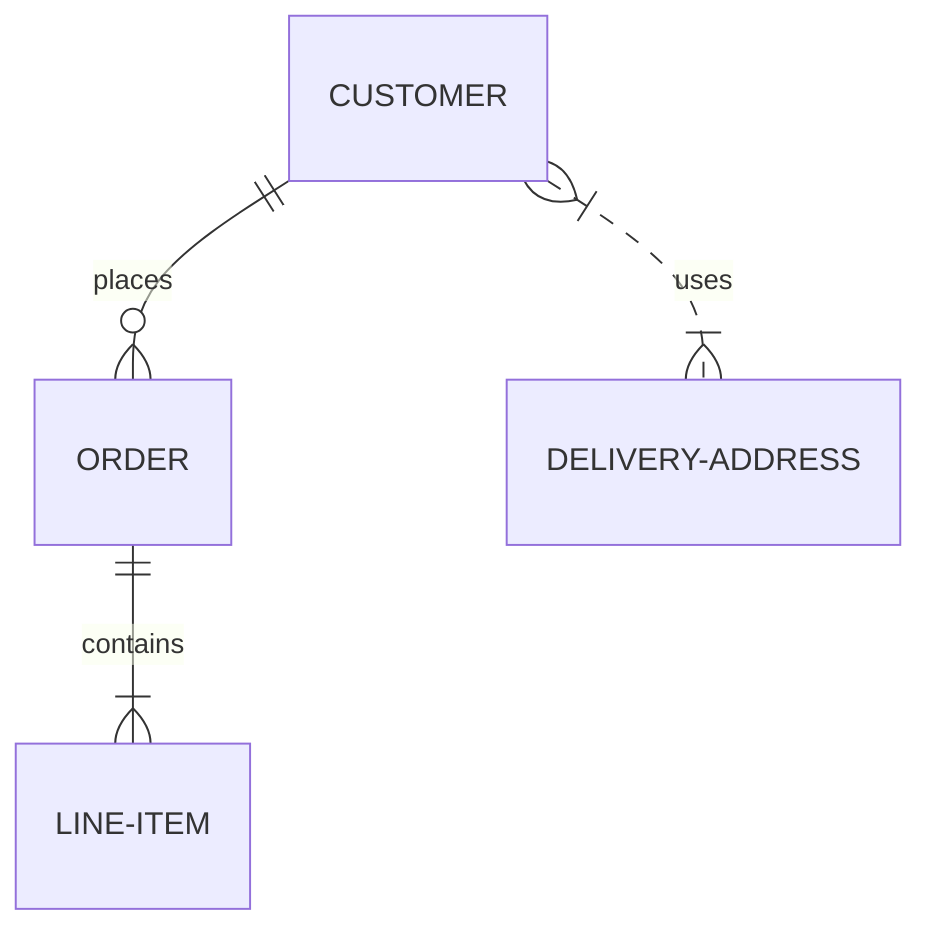
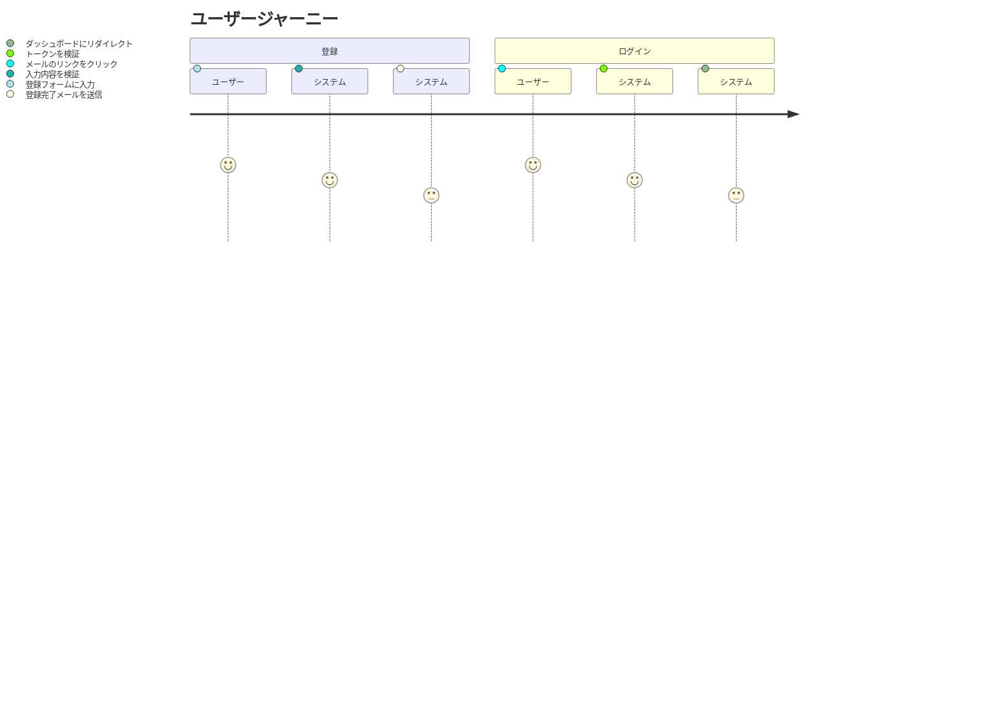
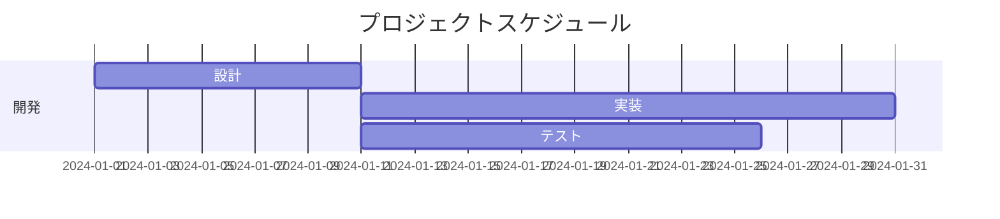
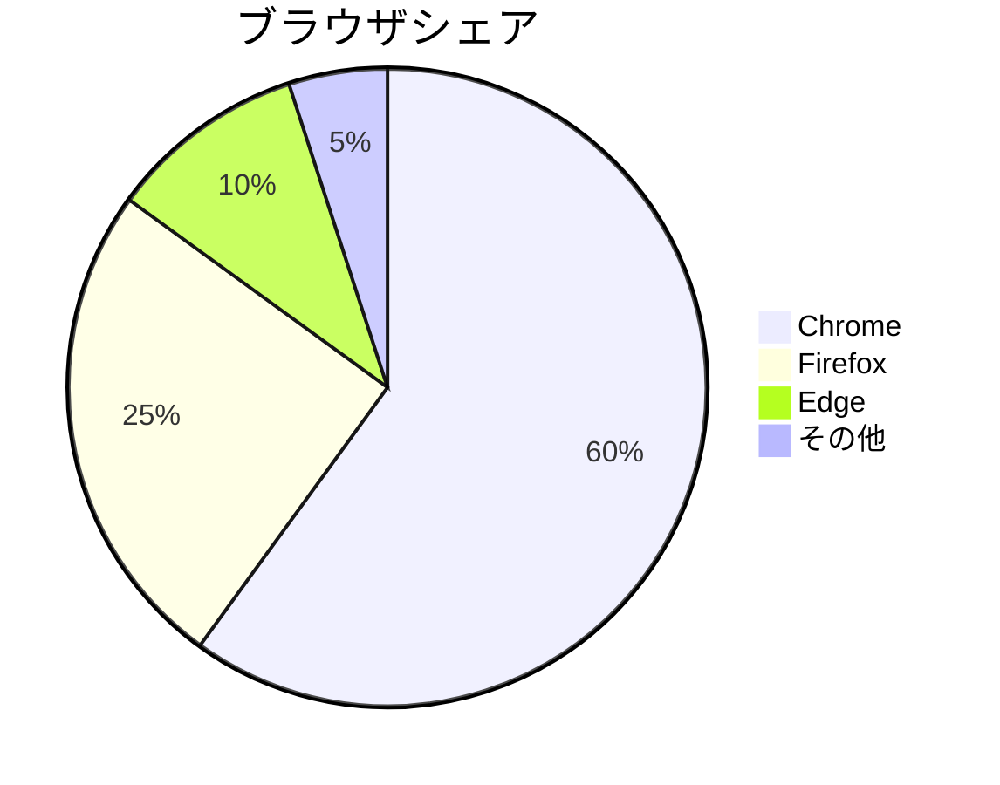
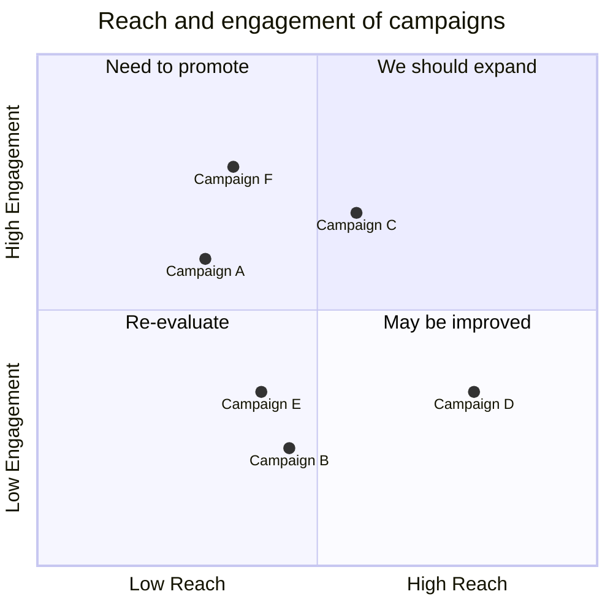
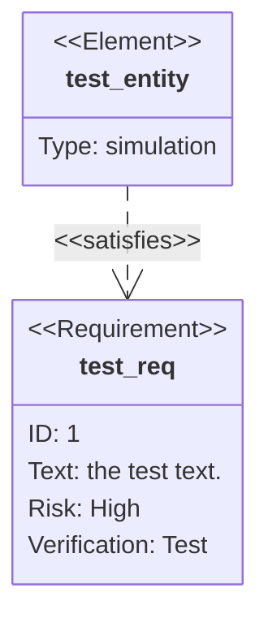

# Mermaid（ローカル描画）テスト

## 1.Flowchart

- flowchart

- graph

## 2.Sequence Diagram

## 3.Class Diagram

## 4.State Diagram

## 5.Entity Relationship(ER) Diagram 

## 6.User Journey

## 7.Gantt

## 8.Pie Chart

## 9.Quadrant Chart

## 10.Requirement Diagram

