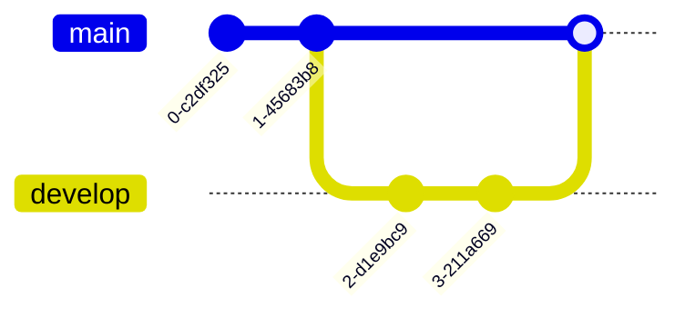
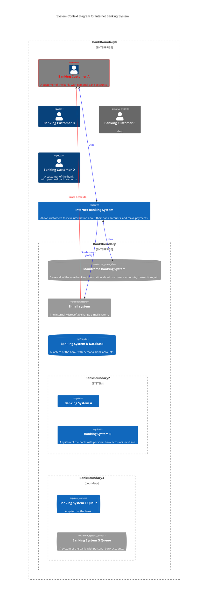
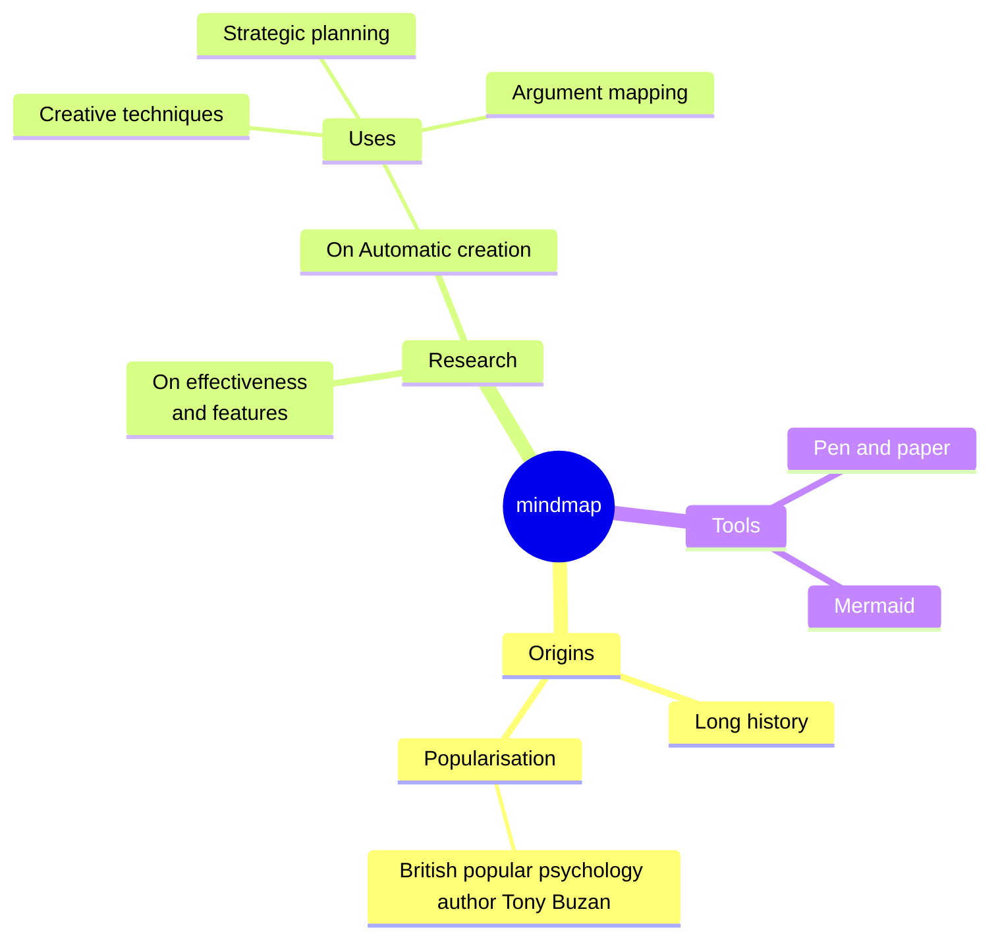
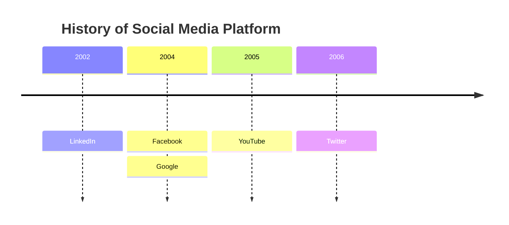
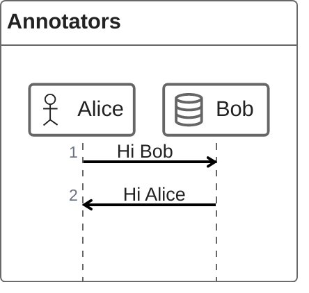
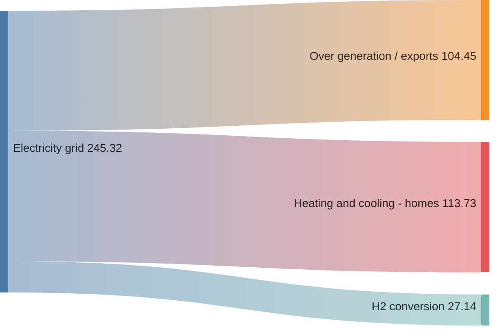
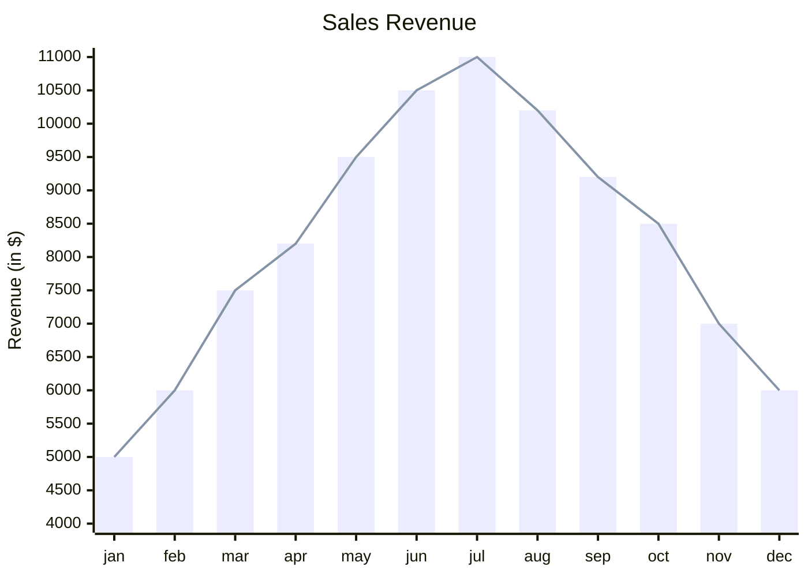
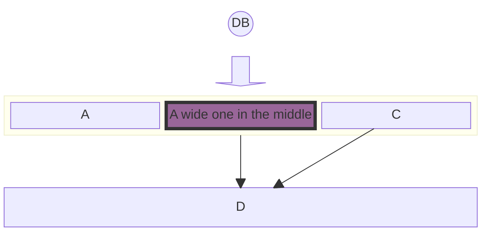
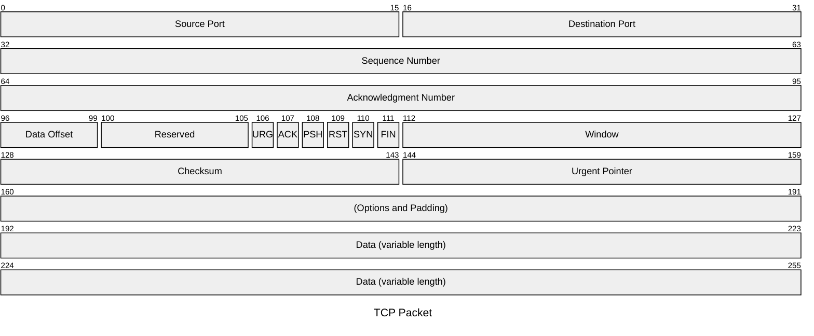
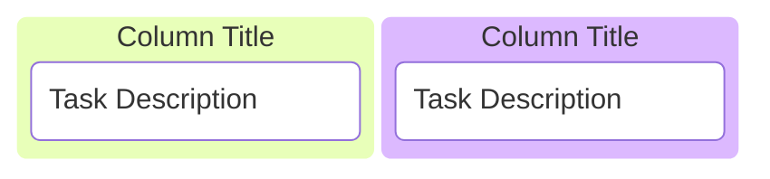

# Mermaid（ローカル描画）テスト

## 11.GitGraph(Git) Diagram

## 12.C4 Diagram

## 13.Mindmap

## 14.Timeline

## 15.ZenUML

## 16.Sankey

## 17.XY Chart

## 18.Block Diagram

## 19.Packet

## 20.Kanban

