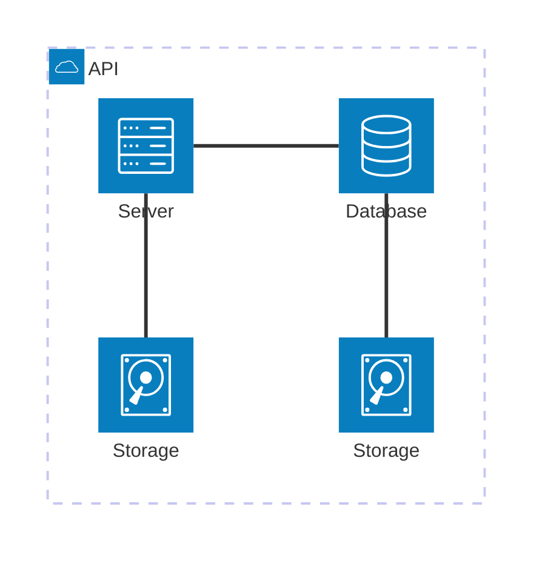
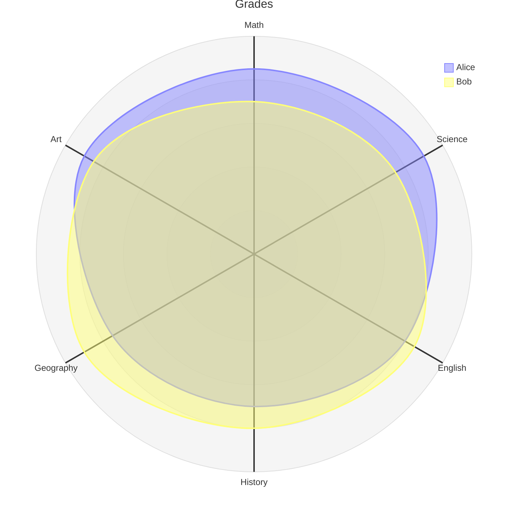
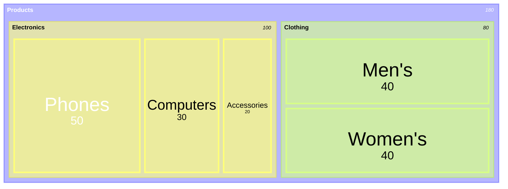

# Mermaid（ローカル描画）テスト

## 21.Architecture

```mermaid
architecture-beta
    group api(cloud)[API]

    service db(database)[Database] in api
    service disk1(disk)[Storage] in api
    service disk2(disk)[Storage] in api
    service server(server)[Server] in api

    db:L -- R:server
    disk1:T -- B:server
    disk2:T -- B:db

```

## 22.Radar

```mermaid
---
title: "Grades"
---
radar-beta
  axis m["Math"], s["Science"], e["English"]
  axis h["History"], g["Geography"], a["Art"]
  curve a["Alice"]{85, 90, 80, 70, 75, 90}
  curve b["Bob"]{70, 75, 85, 80, 90, 85}

  max 100
  min 0

```

## 23.Treemap

```mermaid
treemap-beta
"Products"
    "Electronics"
        "Phones": 50
        "Computers": 30
        "Accessories": 20
    "Clothing"
        "Men's": 40
        "Women's": 40
```