# UML / PlantUML（Kroki）テスト

- uml

```uml
@startuml
Alice -> Bob: Hello
Bob --> Alice: Hi
@enduml
```

- plantuml

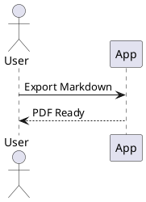

## シーケンス図

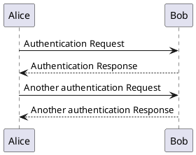

## ユースケース図

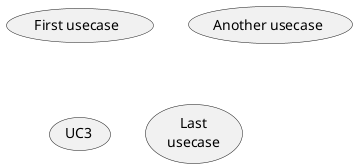

## クラス図

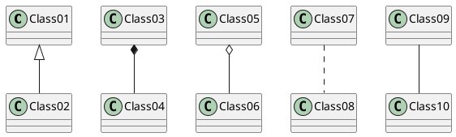

## アクティビティ図

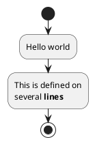

## コンポーネント図

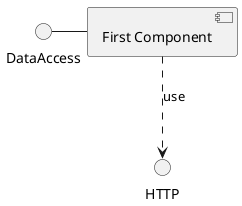

## 状態図

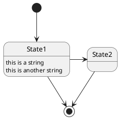

## オブジェクト図

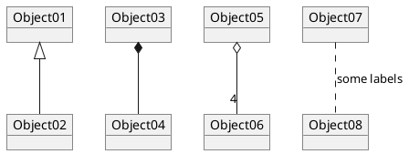

## 配置図

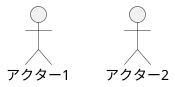

## タイミング図

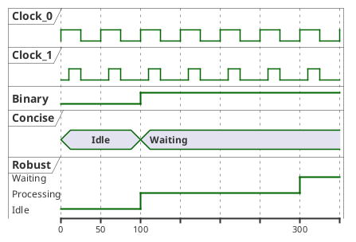

## Regex

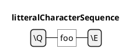

## Network

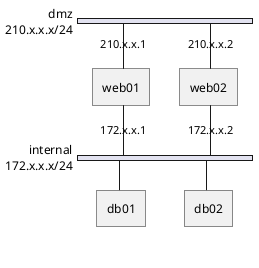

## Wireframe

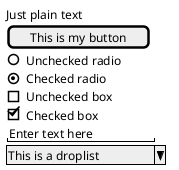

## Archimate

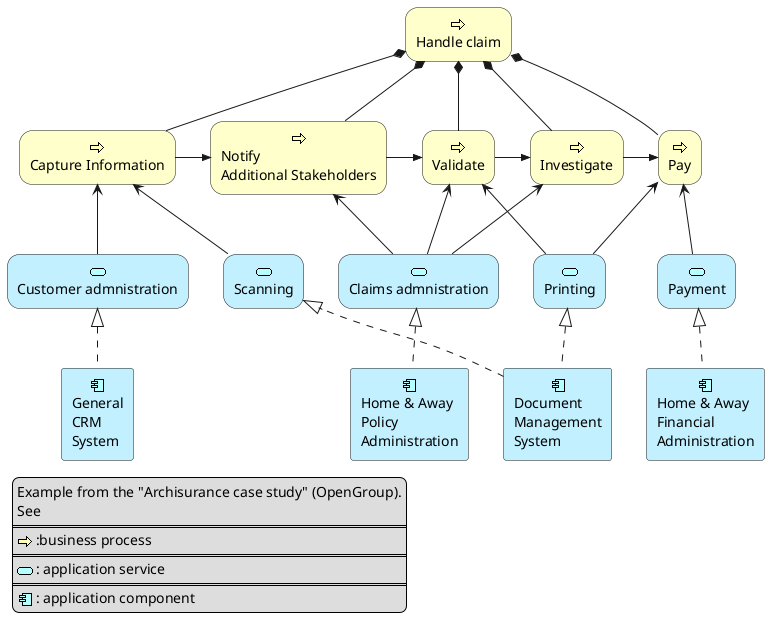

## Gantt

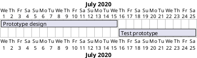

## Chronology

```plantuml
@startchronology
title Chronology Diagram
[A: 2024-01-15 01:08:12] happens on 2024-01-15 01:08:12
[B] happens on 2024-01-15 13:08:12
[C] happens on 2024-01-15 22:12:08
@endchronology
```

## MindMap

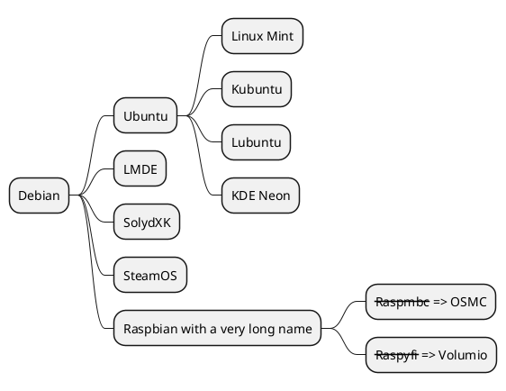

## Work Breakdown Structure (WBS)

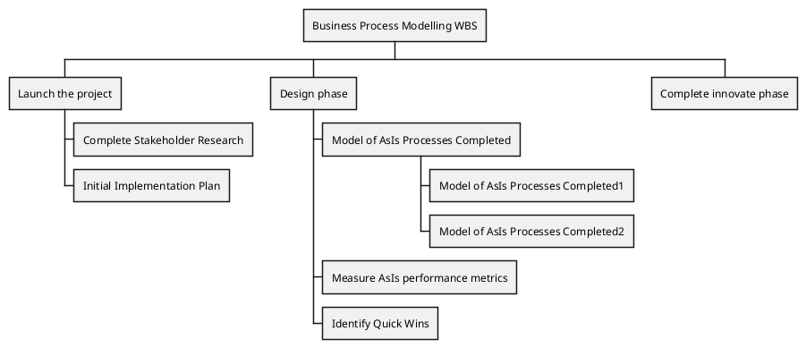

## Syntax (EBNF)

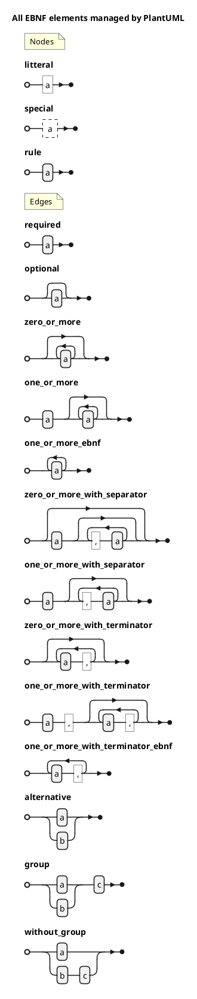

## JSON

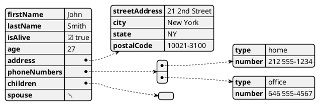

## YAML

```plantuml
@startyaml
doe: "a deer, a female deer"
ray: "a drop of golden sun"
pi: 3.14159
xmas: true
french-hens: 3
calling-birds: 
	- huey
	- dewey
	- louie
	- fred
xmas-fifth-day: 
	calling-birds: four
	french-hens: 3
	golden-rings: 5
	partridges: 
		count: 1
		location: "a pear tree"
	turtle-doves: two
@endyaml
```